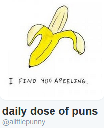

# TwitterBot

<b>
<h2 align="center"> Author: Jackie Luc </h2>
</b>

<h3 align="center"> Description: </h3>
<table style="width:50%", align="center">
    <tr>
        <td style="width:25%"></td>
        <td style="width:25%">

            Uses Twit API to create a bot that sends puns to a Twitter account: <a href="https://twitter.com/alittlepunny">@alittlepunny</a>, every few hours between 7AM - 10PM MST.
        
</td>
    </tr>
</table>

<h3 align="center"> Upcoming features: </h3>

    <li> look for tweets and comments </li>
    <li> reply to mentions </li>
    <li> reply to followings (?) </li>

